# REST API Library - Developer Documentation

## Table of Contents

- [REST API Library - Developer Documentation](#rest-api-library---developer-documentation)
  - [Table of Contents](#table-of-contents)
  - [1. Overview](#1-overview)
    - [1.1. Design Decisions and Trade-offs](#11-design-decisions-and-trade-offs)
    - [1.2. Flowchart: Library Initialization and Usage](#12-flowchart-library-initialization-and-usage)
  - [2. Architecture Documentation](#2-architecture-documentation)
    - [2.1. Introduction](#21-introduction)
    - [2.2. System Architecture Overview](#22-system-architecture-overview)
    - [2.3. Integration Patterns Diagram](#23-integration-patterns-diagram)
    - [2.4. Package Structure and Organization](#24-package-structure-and-organization)
      - [2.4.1. Configuration Loading Flow Diagram:](#241-configuration-loading-flow-diagram)
    - [2.5. Authentication Architecture](#25-authentication-architecture)
    - [2.6. Caching System Design](#26-caching-system-design)
    - [2.7. Data Modeling and Serialization](#27-data-modeling-and-serialization)
    - [2.8. Request Processing Pipeline](#28-request-processing-pipeline)
      - [2.8.1. Data Flow Diagram:](#281-data-flow-diagram)
    - [2.9. State Management and Retry Logic](#29-state-management-and-retry-logic)
    - [2.10. Token Lifecycle Management](#210-token-lifecycle-management)
    - [2.11. Error Handling and Exception Hierarchy](#211-error-handling-and-exception-hierarchy)
    - [2.12. Performance and Scalability Considerations](#212-performance-and-scalability-considerations)
    - [2.13. Security Architecture and Best Practices](#213-security-architecture-and-best-practices)
    - [2.14. Extensibility and Customization Framework](#214-extensibility-and-customization-framework)
  - [3. Module/Class/Function Docs: Deep Explanations](#3-moduleclassfunction-docs-deep-explanations)
    - [3.1. Class-by-Class Breakdown (Deep Internals)](#31-class-by-class-breakdown-deep-internals)
      - [3.1.1. `BaseModel` (restapi\_library/models/base.py)](#311-basemodel-restapi_librarymodelsbasepy)
      - [3.1.2. `APIClient` (restapi\_library/core/client.py)](#312-apiclient-restapi_librarycoreclientpy)
      - [3.1.3. `APIEndpoint` (restapi\_library/core/endpoint.py)](#313-apiendpoint-restapi_librarycoreendpointpy)
      - [3.1.4. `ConfigParser` (restapi\_library/core/config.py)](#314-configparser-restapi_librarycoreconfigpy)
      - [3.1.5. `RestAPILibrary` (restapi\_library/init.py)](#315-restapilibrary-restapi_libraryinitpy)
    - [3.2. Main Configuration File Explanation](#32-main-configuration-file-explanation)
      - [3.2.1. Structure](#321-structure)
      - [3.2.2. Required Components](#322-required-components)
      - [3.2.3. Optional Components with Defaults](#323-optional-components-with-defaults)
      - [3.2.3. Authentication Configuration](#323-authentication-configuration)
      - [Dynamic Token Subfields](#dynamic-token-subfields)
        - [Example Authentication Configuration](#example-authentication-configuration)
      - [3.2.5. Example Configuration File](#325-example-configuration-file)
      - [3.2.6 Example Input/Output with Configuration](#326-example-inputoutput-with-configuration)
    - [3.3. Extending the Library: Plugin or Customization Support](#33-extending-the-library-plugin-or-customization-support)
      - [3.3.1. Middleware Support](#331-middleware-support)
      - [3.3.2. Custom Authentication Handlers](#332-custom-authentication-handlers)
      - [3.3.3. Custom Models](#333-custom-models)
      - [3.3.4. Response Transformation](#334-response-transformation)
      - [3.3.5. Custom Cache Implementations](#335-custom-cache-implementations)
      - [3.3.6. Custom Logging](#336-custom-logging)
      - [3.3.7. Key Considerations](#337-key-considerations)
  - [4. Development Guide: Setup, Testing, Contributing](#4-development-guide-setup-testing-contributing)
    - [4.1. Setup](#41-setup)
    - [4.2. Testing](#42-testing)
    - [4.3. Testing Overview: How Tests Are Structured](#43-testing-overview-how-tests-are-structured)
      - [4.3.1. Test Directory Structure](#431-test-directory-structure)
      - [4.3.2. Test Types](#432-test-types)
      - [4.3.3. Test Conventions](#433-test-conventions)
      - [4.3.4. Example Test](#434-example-test)
      - [4.3.5. Running Tests](#435-running-tests)
    - [4.4. Dependencies \& Tools](#44-dependencies--tools)
      - [4.4.1. Core Dependencies](#441-core-dependencies)
      - [4.4.2. Development Dependencies](#442-development-dependencies)
      - [4.4.3. Tools Used](#443-tools-used)
      - [4.4.4. Installation](#444-installation)

---
## 1. Overview 

The REST API Library is a Python framework designed to simplify RESTful API interactions through a modular, configuration-driven approach. It enables developers to define APIs in JSON files, specifying endpoints, authentication, caching, and data models, which the library uses to generate dynamic API clients. These clients handle HTTP requests, authentication (e.g., Bearer or dynamic tokens), caching (in-memory or Redis), and retries with exponential backoff, offering a clean interface for structured data.

The library was created to eliminate repetitive coding for API integrations, such as handling requests, token management, and error retries, which are often time-consuming and error-prone. By centralizing API definitions in JSON, it streamlines development and enhances maintainability, allowing developers to adapt to new or changing APIs without code changes.

Key design decisions include a JSON-based configuration system for flexibility and a synchronous `requests` library for simplicity. The configuration approach allows easy updates but requires learning the schema, mitigated by a CLI for validation and templates. Synchronous HTTP is intuitive but less efficient for high concurrency, with connection pooling used to optimize performance and async support planned. The modular architecture, using factory patterns for authentication and caching, supports extensions but adds complexity for customizations, offset by robust error handling and logging.

The vision is a balance of simplicity and flexibility, prioritizing ease of use for developers while supporting advanced use cases like custom models. Performance is enhanced through caching and retries, with future plans for async support to improve scalability.

Alternatives considered include an async-first design with `aiohttp` (too complex for some users like me), OpenAPI-based definitions (too restrictive), and monolithic architecture (hard to maintain). The chosen design favors modularity and simplicity, making the library versatile for small and large projects.

### 1.1. Design Decisions and Trade-offs

The following table summarizes the key design decisions, their benefits, and the trade-offs involved, providing a quick reference for developers.

|**Design Decision**|**Description**|**Benefits**|**Trade-offs**|
|---|---|---|---|
|Configuration-Driven Architecture|APIs and endpoints are defined in JSON files, parsed by `ConfigParser`.|Enhances maintainability; changes don’t require code edits; supports multiple APIs.|Requires learning the configuration schema; complex configs can be error-prone.|
|Synchronous HTTP with `requests`|Uses `requests.Session` for HTTP communication.|Simple to use and debug; widely compatible with Python codebases.|Less efficient for high-concurrency scenarios compared to async libraries.|
|Modular Architecture|Components like auth and caching use factory patterns.|Easy to extend with custom handlers or backends; promotes code reuse.|Increased complexity for developers extending the system.|
|Structured Logging|JSON-based logging for requests, responses, and errors.|Simplifies debugging and monitoring; machine-readable logs.|Adds slight overhead to request processing.|

### 1.2. Flowchart: Library Initialization and Usage

Below is a flowchart illustrating how the library is initialized and used, providing a visual overview of the process.

![[docs/source/_static/imgFlowChart.png]]

This flowchart shows the lifecycle from loading a configuration to returning a response, highlighting the interaction between components like `ConfigParser`, `APIClient`, and authentication/caching systems.

---

## 2. Architecture Documentation

### 2.1. Introduction

The library's architecture follows established software engineering principles, including dependency injection, factory patterns, and abstract base classes, creating a cohesive system that can adapt to various API integration scenarios. By providing a declarative configuration approach, the framework eliminates boilerplate code and reduces the potential for integration errors, making it suitable for both simple API interactions and complex enterprise integrations.

### 2.2. System Architecture Overview

The REST API Library employs a layered architecture that separates concerns across distinct functional domains. This design ensures that each component has a well-defined responsibility while maintaining loose coupling between layers, facilitating testing, maintenance, and future enhancements.

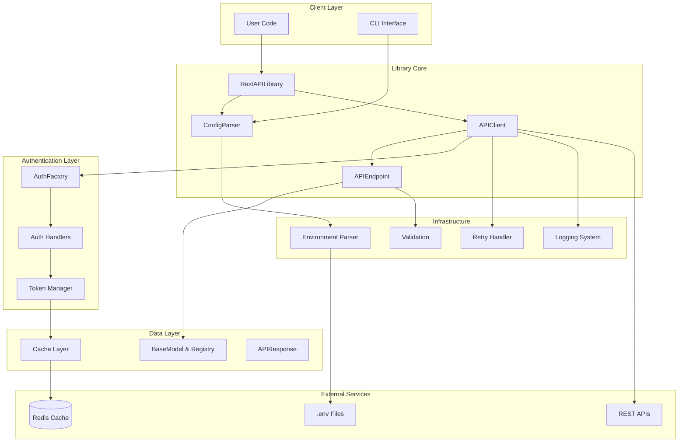

The high-level architecture demonstrates how the library orchestrates various components to provide a seamless API interaction experience. The Client Layer serves as the entry point, where user code interacts with the library through the main RestAPILibrary class or the command-line interface. The Library Core contains the fundamental components responsible for configuration parsing, client management, and endpoint handling.

The Authentication Layer abstracts the complexity of various authentication mechanisms, from simple bearer tokens to sophisticated dynamic token management with automatic refresh capabilities. The Data Layer manages request and response models, provides caching capabilities, and ensures proper data serialization and validation. Finally, the Infrastructure layer provides cross-cutting concerns such as logging, retry logic, and environment variable parsing.

This architectural approach ensures that concerns are properly separated while maintaining efficient communication between components. The design allows for easy extension and customization, enabling developers to implement custom authentication handlers, cache backends, or data models without modifying the core library code.
### 2.3. Integration Patterns Diagram

The Integration Patterns diagram illustrates how the REST API Library connects with applications and external services. It shows the flow from user applications, through configuration and environment files, to the library’s API clients, which interact with external APIs, Redis for caching, and log files for monitoring, highlighting the library’s role in a production environment.

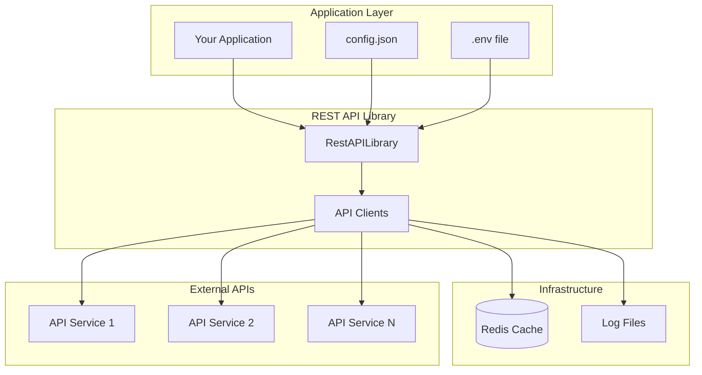

### 2.4. Package Structure and Organization

The library's package structure reflects its modular design philosophy, organizing related functionality into cohesive units that can be understood and maintained independently. This organization facilitates code navigation, testing, and future enhancements while maintaining clear boundaries between different aspects of the system.

- **restapi_library/**: Root package.
    - `__init__.py`: Defines `RestAPILibrary`, initializes clients using `ConfigParser`.
    - `cli.py`: CLI for configuration validation and template generation, depends on `core/config.py`.
	- **core/**: Core functionality.
	    - `client.py`: `APIClient` for request execution, depends on `auth`, `cache`, `models`, `utils`.
	    - `config.py`: `ConfigParser` for JSON parsing with environment variable support, uses `utils/env_parser.py`.
	    - `endpoint.py`: `APIEndpoint` for endpoint logic, uses `utils/validation.py`, `utils/decorators.py`, `cache`, `models`.
	    - `exceptions.py`: Custom exceptions (e.g., `RestAPIException`, `APIError`).
	    - `types.py`: Enums and types (e.g., `AuthType`, `HTTPMethod`).
	    - `defaults.py`: Default configuration values.
	- **auth/**: Authentication handling.
	    - `base.py`: Abstract `BaseAuthHandler` interface.
	    - `handlers.py`: Static auth handlers (`BearerAuthHandler`, `BasicAuthHandler`, `APIKeyAuthHandler`).
	    - `dynamic_token.py`: Dynamic token refresh, depends on `cache`.
	    - `factory.py`: Creates auth handlers, used by `client.py`.
	- **cache/**: Caching mechanisms.
	    - `base.py`: Abstract `BaseCache` interface.
	    - `memory.py`: In-memory cache.
	    - `redis_cache.py`: Redis cache, depends on `redis` library.
	    - `factory.py`: Creates cache instances, used by `client.py`, `auth`.
	- **models/**: Data modeling.
	    - `base.py`: `BaseModel` for serialization and validation.
	    - `registry.py`: `ModelRegistry` for model management, used by `client.py`, `endpoint.py`.
	    - `response.py`: `APIResponse` for response wrapping.
	- **utils/**: Supporting utilities.
	    - `env_parser.py`: Environment variable parsing, used by `config.py`.
	    - `retry.py`: Retry logic, used by `client.py`, `endpoint.py`.
	    - `logging.py`: Structured logging, used across modules.
	    - `validation.py`: Parameter validation, used by `endpoint.py`.
	    - `helpers.py`: Utility functions (e.g., URL joining, cache key generation).
	    - `decorators.py`: Rate limiting and caching decorators, used by `endpoint.py`.

The core package contains the fundamental building blocks of the library, including the main `APIClient` class that orchestrates API interactions, the `ConfigParser` that handles configuration management with environment variable substitution, and the `APIEndpoint` class that encapsulates endpoint-specific logic. The exceptions module provides a comprehensive hierarchy of custom exceptions that enable precise error handling, while the types module defines enums and type definitions that ensure type safety throughout the library.

The auth package implements a flexible authentication system using the factory pattern, allowing for easy extension with new authentication mechanisms. The base module defines the abstract interface that all authentication handlers must implement, while specific handlers provide concrete implementations for common authentication methods. The dynamic token handler demonstrates the library's sophisticated approach to token management, including automatic refresh and caching capabilities.

The models package provides a robust data modeling system centered around the BaseModel class, which offers serialization, deserialization, and validation capabilities. The registry pattern allows for dynamic model management, enabling runtime model selection based on configuration. The cache package follows a similar pattern, providing a unified interface for different caching backends while maintaining the flexibility to add new implementations.

The utils package contains supporting utilities that provide cross-cutting functionality used throughout the library. These utilities handle concerns such as retry logic with exponential backoff, comprehensive logging with sensitive data filtering, environment variable parsing, and parameter validation. This organization ensures that common functionality is centralized and reusable while maintaining clean separation of concerns.
#### 2.4.1. Configuration Loading Flow Diagram:

The Configuration Loading Flow diagram outlines the steps for initializing API clients from a JSON configuration. It shows how the library loads environment variables, parses the config, substitutes variables, applies defaults, validates the structure, and creates clients with appropriate auth and cache settings, ensuring robust setup before API interactions.

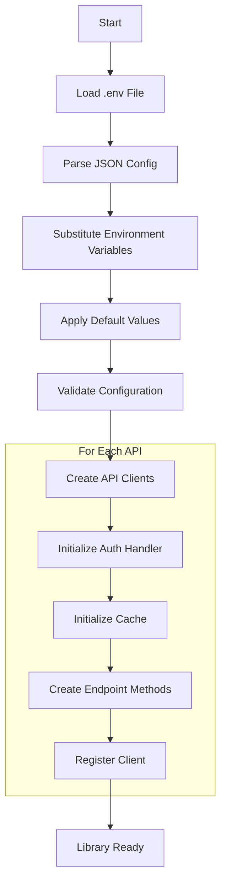


### 2.5. Authentication Architecture

The authentication system represents one of the library's most sophisticated components, designed to handle a wide variety of authentication scenarios from simple API keys to complex OAuth2 flows with automatic token refresh. The architecture emphasizes flexibility and extensibility while providing secure token management and caching capabilities.

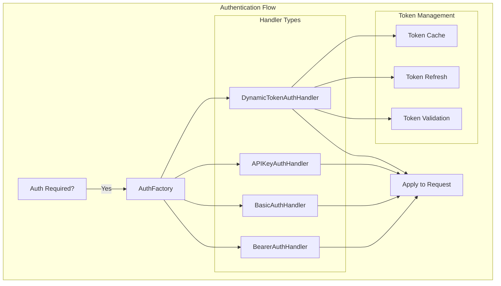

The authentication architecture employs the factory pattern to provide a unified interface for creating and managing different types of authentication handlers. This design allows the library to support multiple authentication methods while maintaining a consistent interface for the rest of the system. The AuthFactory examines the configuration and instantiates the appropriate handler based on the specified authentication type.

Static authentication handlers provide implementations for common, straightforward authentication methods such as bearer tokens, basic authentication, and API keys. These handlers are lightweight and stateless, simply applying the configured credentials to outgoing requests. The design ensures that these common use cases remain simple and efficient while providing the foundation for more complex authentication scenarios.

The DynamicTokenAuthHandler represents the library's most sophisticated authentication component, designed to handle modern API authentication patterns that require token refresh and lifecycle management. This handler manages the complete token lifecycle, including initial authentication, token validation, automatic refresh, and secure caching. The handler intelligently determines when tokens need refreshing and handles both successful refresh scenarios and fallback to re-authentication when refresh tokens become invalid.

Token management within the dynamic handler includes sophisticated caching strategies that balance security with performance. Tokens are cached with appropriate time-to-live values that account for token expiration times, and the handler includes buffer periods to ensure tokens are refreshed before they expire. The caching mechanism supports both in-memory and Redis backends, allowing for token sharing across application instances in distributed environments.

### 2.6. Caching System Design

The caching system provides intelligent response caching and token management, designed to improve performance while maintaining data consistency and security. The architecture supports multiple caching backends and provides fine-grained control over caching behavior at both the global and endpoint levels.

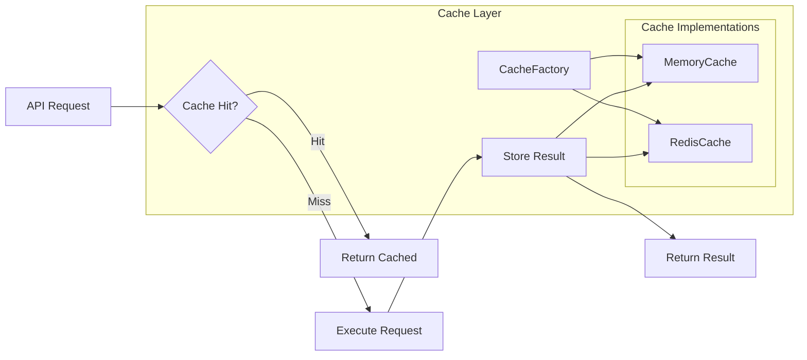

The caching architecture follows the same factory pattern used throughout the library, providing a unified interface for different caching implementations while allowing for easy extension with new backends. The BaseCache interface defines the contract that all cache implementations must follow, ensuring consistency and enabling seamless switching between different caching strategies.

The MemoryCache implementation provides high-performance, in-process caching suitable for single-instance applications or scenarios where cache sharing across instances is not required. This implementation includes time-based expiration with automatic cleanup of expired entries, ensuring that memory usage remains bounded. The implementation is thread-safe and provides optimal performance for read-heavy workloads.

The RedisCache implementation enables distributed caching scenarios where multiple application instances need to share cached data. This implementation provides persistence, scalability, and the ability to share authentication tokens across distributed application instances. The Redis implementation includes connection pooling, automatic reconnection handling, and serialization management for complex data types.

The caching system integrates seamlessly with the request processing pipeline, automatically checking for cached responses before making API calls and storing responses according to configured caching policies. The system respects HTTP cache headers when present and provides override mechanisms for specific endpoint requirements. Cache keys are generated using a combination of endpoint information, parameters, and user context to ensure proper cache isolation while maximizing cache hit rates.

### 2.7. Data Modeling and Serialization

The data modeling system provides a comprehensive framework for handling request and response data with automatic serialization, validation, and type safety. The architecture emphasizes ease of use while providing the flexibility needed for complex data transformations and validation scenarios.

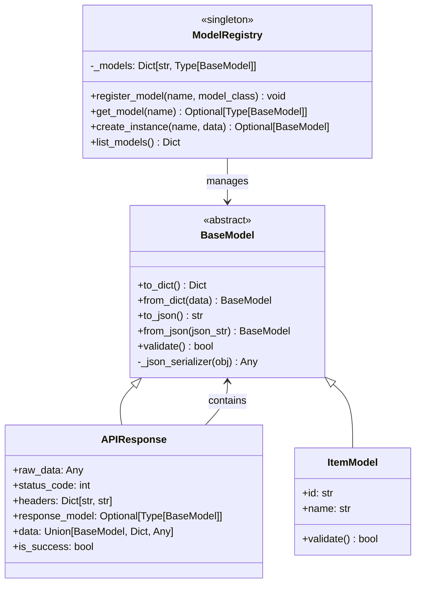

>[!Note]
> `ItemModel` are example models from the CLI template in `cli.py`, illustrating how custom models extend `BaseModel`.

The BaseModel class serves as the foundation for all data models within the library, providing a consistent interface for serialization, deserialization, and validation. The class includes methods for converting between Python objects and various serialization formats, including JSON and dictionary representations. The design supports both simple data structures and complex nested objects, with automatic handling of model composition and circular reference detection.

The validation system within BaseModel provides a framework for implementing custom validation logic while maintaining consistency across different model types. The base implementation provides structural validation, ensuring that required fields are present and that data types are appropriate. Subclasses can override the validation method to implement business-specific validation rules, enabling comprehensive data quality assurance at the model level.

The ModelRegistry implements a registry pattern that enables dynamic model management and selection based on configuration. This design allows the library to automatically instantiate appropriate model classes based on endpoint configuration, eliminating the need for explicit model selection in user code. The registry supports runtime model registration, enabling dynamic model loading and plugin-based architectures.

```python
from restapi_library import BaseModel
from dataclasses import dataclass
from typing import Optional

@dataclass
class UserModel(BaseModel):
    name: str
    email: str
    age: Optional[int] = None
    
    def validate(self) -> bool:
        return "@" in self.email and len(self.name) > 0
```

``` python
# Register the model
RestAPILibrary.register_model('UserModel', UserModel)
```

The APIResponse class provides a unified wrapper for API responses that handles the complexity of different response formats and provides consistent access to response data, status information, and metadata. The class automatically attempts to parse response data using registered models when appropriate, falling back to raw data access when model parsing is not possible or not configured. This approach ensures that users always have access to response data while benefiting from structured access when models are available.

### 2.8. Request Processing Pipeline

The request processing pipeline orchestrates the complex flow of API requests through various stages of preparation, execution, and response handling. This pipeline design ensures that all aspects of request processing, from parameter validation to response caching, are handled consistently and efficiently.

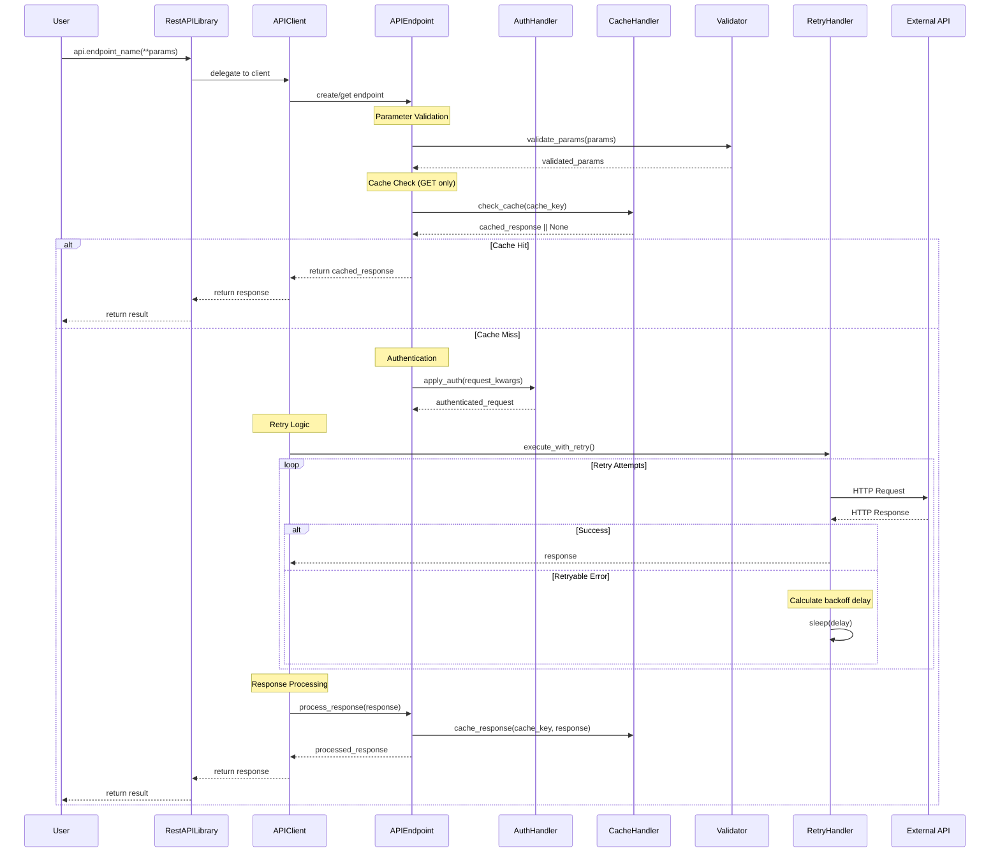

The request processing pipeline begins when user code invokes an endpoint method on a RestAPILibrary instance. The library delegates this call to the appropriate APIClient, which retrieves or creates the corresponding APIEndpoint instance. This delegation pattern ensures that each API can maintain its own configuration and state while providing a unified interface to user code.

Parameter validation represents the first critical stage of request processing, where the Validator component examines incoming parameters against the endpoint's configuration schema. This validation includes type checking, required field verification, and format validation. The validation stage prevents invalid requests from reaching external APIs, reducing unnecessary network traffic and providing immediate feedback to developers about parameter issues.

The caching layer integration demonstrates the pipeline's efficiency optimization, where GET requests are automatically checked against the configured cache before proceeding with API execution. This caching check uses intelligent cache key generation that considers endpoint configuration, parameters, and user context to ensure appropriate cache isolation. When cache hits occur, the pipeline immediately returns cached responses, dramatically reducing latency and external API load.

When cache misses occur or caching is not applicable, the pipeline proceeds through authentication application, where the configured authentication handler modifies the request to include appropriate credentials. The authentication stage is context-aware, supporting different authentication requirements for different endpoints within the same API configuration.

The retry logic integration ensures robust handling of transient failures, with the RetryHandler implementing sophisticated exponential backoff algorithms with ==`jitter`== to prevent overwhelming failing services. The retry mechanism is configurable at both global and endpoint levels, allowing for fine-tuned control over retry behavior based on specific API characteristics and requirements.
#### 2.8.1. Data Flow Diagram:

The Data Flow Diagram provides a high-level view of how API requests flow through the library. It illustrates the path from user invocation through validation, caching, authentication, retries, and response parsing, showing how components interact to deliver efficient and reliable API interactions.


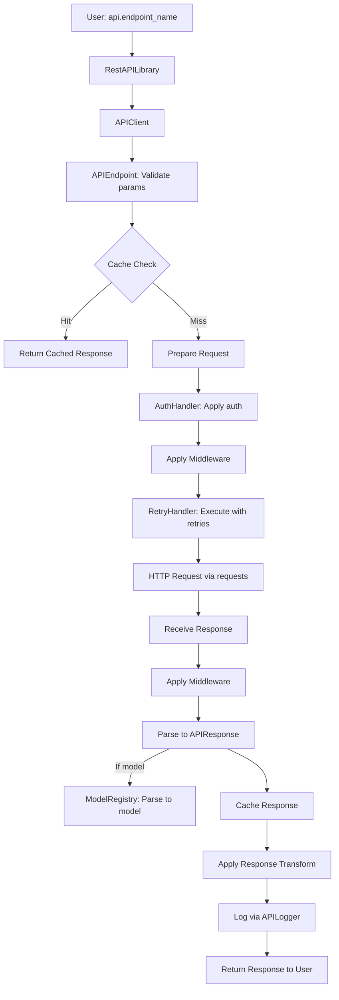


### 2.9. State Management and Retry Logic

The library implements sophisticated state management for handling transient failures and token lifecycle management. The retry logic employs a state machine approach that provides predictable behavior while supporting complex retry scenarios with exponential backoff and jitter.

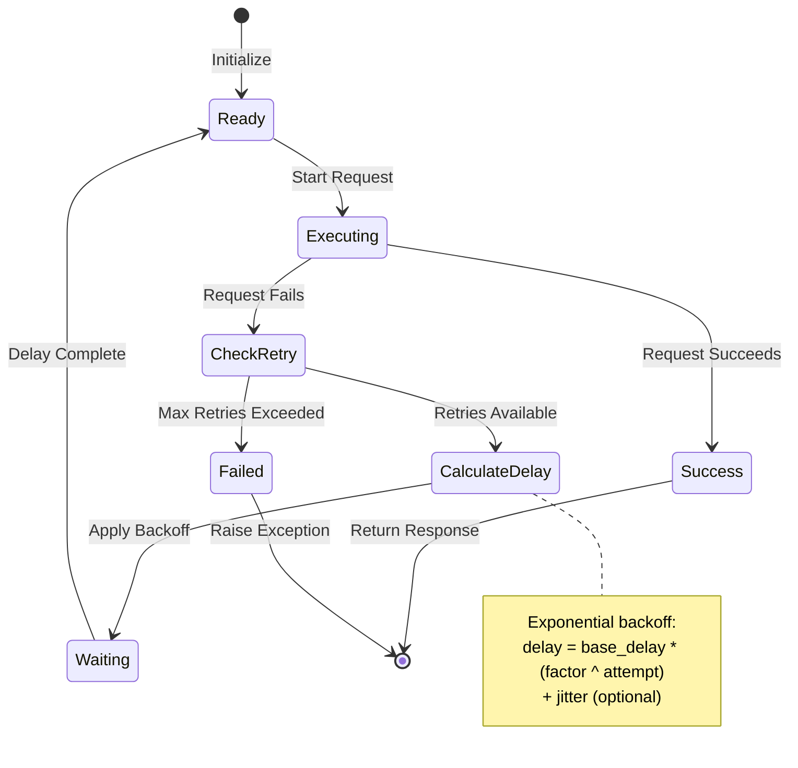

The retry state machine provides a clear model for understanding and predicting retry behavior under various failure scenarios. The machine begins in a Ready state when a request is initiated, transitioning to Executing when the actual HTTP request begins. Successful requests lead directly to the Success state and completion, while failures trigger the retry evaluation logic.

The CheckRetry state represents the decision point where the system evaluates whether additional retry attempts should be made based on the configured retry policy, the type of error encountered, and the number of previous attempts. This evaluation considers both the maximum retry count and the nature of the error, with certain error types being excluded from retry logic to prevent futile attempts.

The CalculateDelay state implements the exponential backoff algorithm, which increases delays between retry attempts to reduce load on failing services and improve the probability of eventual success. The algorithm includes optional jitter to prevent synchronized retry attempts from multiple clients, which could overwhelm recovering services. The delay calculation considers both the base delay configuration and the current attempt number to provide appropriate spacing between retries.

The Waiting state represents the actual delay period, during which the retry handler sleeps before attempting the next request. This state ensures that retry attempts are properly spaced and that the system doesn't immediately hammer failing services with repeated requests. The state machine design makes this delay explicit and manageable, allowing for proper resource management and monitoring.

### 2.10. Token Lifecycle Management

The dynamic token authentication system implements a comprehensive token lifecycle management system that handles the complexity of modern API authentication patterns while providing transparent operation to user code.

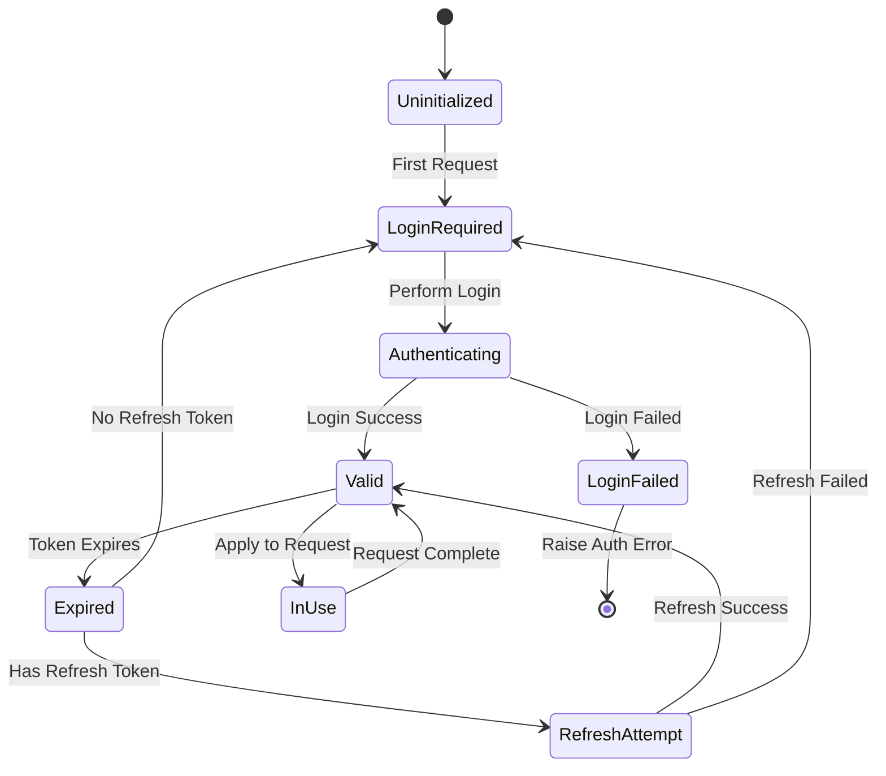

The token lifecycle begins in an Uninitialized state when a DynamicTokenAuthHandler is first created. The first API request that requires authentication triggers a transition to LoginRequired, where the handler must obtain initial authentication credentials. This design ensures that authentication is performed only when needed, avoiding unnecessary authentication calls for endpoints that don't require authentication.

The Authenticating state represents the process of obtaining initial tokens through the configured login endpoint. This process includes making the authentication request, parsing the response to extract token information, and setting up token expiration tracking. Successful authentication transitions to the Valid state, while authentication failures result in LoginFailed and appropriate exception raising.

The Valid state represents normal operation where tokens are available and valid for use in API requests. From this state, tokens can transition to Expired when their expiration time is reached, or to InUse when they are being applied to outgoing requests. The InUse state is brief and immediately returns to Valid upon request completion, but it's explicitly modeled to handle potential race conditions in multi-threaded environments.

The Expired state triggers the token refresh logic, which attempts to use refresh tokens to obtain new access tokens without requiring full re-authentication. The success of this refresh attempt determines whether the system returns to Valid operation or must fall back to full re-authentication. This refresh mechanism significantly improves user experience by maintaining authenticated sessions without interruption.

The RefreshAttempt state encapsulates the complexity of token refresh operations, including making refresh requests, handling various refresh failure scenarios, and updating cached token information. The state machine design ensures that refresh failures are handled gracefully, with automatic fallback to full re-authentication when refresh tokens become invalid or expired.

### 2.11. Error Handling and Exception Hierarchy

The library implements a comprehensive exception hierarchy that provides precise error classification and handling capabilities. This hierarchy enables applications to implement appropriate error handling strategies based on the specific type and context of errors encountered during API interactions.

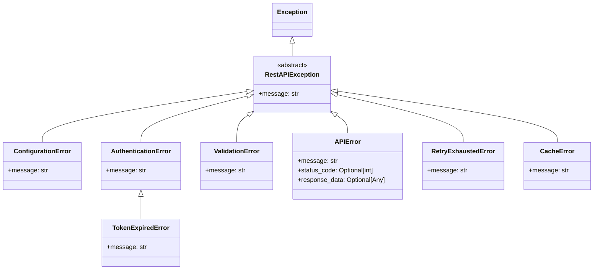

The exception hierarchy is rooted in the RestAPIException base class, which provides common functionality and ensures that all library exceptions can be caught uniformly when desired. This design allows applications to implement both broad exception handling for general error scenarios and specific handling for particular error types that require specialized responses.

ConfigurationError exceptions indicate problems with library configuration, such as missing required configuration values, invalid configuration formats, or incompatible configuration combinations. These exceptions typically occur during library initialization and indicate issues that must be resolved before the library can function properly. The clear identification of configuration errors helps developers quickly identify and resolve setup issues.

AuthenticationError exceptions encompass all authentication-related failures, from invalid credentials to authentication service unavailability. The hierarchy includes TokenExpiredError as a specialized authentication error that specifically indicates token expiration, enabling applications to implement token refresh logic or user re-authentication flows as appropriate.

ValidationError exceptions indicate problems with request data, including missing required parameters, invalid parameter types, or data that fails business logic validation. These exceptions help ensure data quality and provide clear feedback about what corrections are needed. The validation error context includes information about which specific validations failed, enabling precise error reporting and correction guidance.

APIError exceptions represent failures in actual API communication, including HTTP errors, malformed responses, and service unavailability. These exceptions include detailed context about the failure, including HTTP status codes and response data when available. This information enables applications to implement appropriate retry logic, fallback strategies, or user notification based on the specific nature of the API failure.

### 2.12. Performance and Scalability Considerations

The library's architecture incorporates several design patterns and optimizations specifically chosen to support high-performance and scalable API integrations. These considerations influence both the overall architecture and specific implementation details throughout the system.


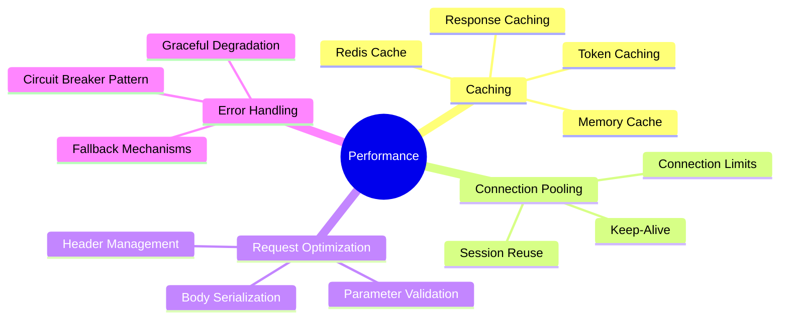

Connection pooling and session reuse form the foundation of the library's performance strategy. The library uses persistent HTTP sessions for each API client, which enables connection reuse and reduces the overhead of establishing new connections for each request. This approach significantly improves performance for applications that make multiple requests to the same API endpoints, which represents the majority of real-world usage patterns.

The caching system provides multiple levels of optimization, from response caching to token caching, each designed to reduce unnecessary network traffic and improve response times. The cache key generation algorithm ensures optimal cache hit rates while maintaining appropriate cache isolation. The support for distributed caching through Redis enables horizontal scaling scenarios where multiple application instances can share cached data and authentication tokens.

The retry logic implementation includes jitter and exponential backoff specifically designed to prevent thundering herd problems when multiple clients are accessing failing services. This approach improves overall system stability and reduces load on recovering services, contributing to better performance characteristics across distributed systems.

### 2.13. Security Architecture and Best Practices

Security considerations are integrated throughout the library's architecture, from secure credential handling to comprehensive logging controls that prevent sensitive data exposure. The security model addresses both data protection and operational security concerns.

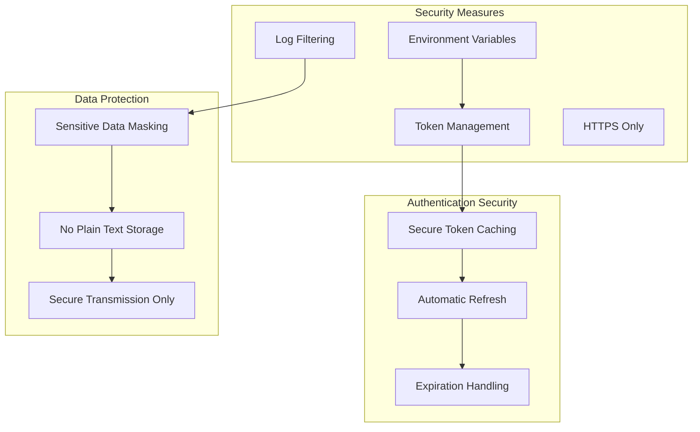

Environment variable integration provides secure credential management by preventing sensitive information from being stored in configuration files or source code. The environment parser supports default values and complex substitution patterns while ensuring that credentials are loaded securely from the runtime environment. This approach aligns with modern security best practices and supports containerized deployment scenarios.

Token management within the authentication system includes secure caching with appropriate time-to-live values and automatic cleanup of expired credentials. The dynamic token handler implements buffer periods for token refresh to ensure that tokens are renewed before expiration, preventing authentication failures due to timing issues. The token caching mechanism supports encryption and secure storage when using Redis backends.

Logging security features include automatic filtering of sensitive data from log outputs, ensuring that credentials, tokens, and other sensitive information are not inadvertently exposed in log files. The logging system provides configurable sensitivity levels and supports custom filters for application-specific sensitive data patterns. This approach enables comprehensive logging for debugging and monitoring while maintaining security compliance.

The library's HTTPS-only policy for external API communications ensures that all data transmission is encrypted in transit. The session management includes certificate verification and supports custom certificate authorities when required for enterprise environments. These security measures provide defense in depth while maintaining compatibility with various deployment scenarios.

### 2.14. Extensibility and Customization Framework

The library's architecture prioritizes extensibility through well-defined extension points and plugin interfaces that enable customization without modifying core library code. This design supports both simple customizations and complex enterprise-specific requirements.

Custom authentication handlers can be implemented by extending the ==`BaseAuthHandler`== abstract class and implementing the required interface methods. This pattern enables support for proprietary authentication schemes, complex multi-factor authentication flows, and integration with enterprise identity management systems. The factory pattern registration allows custom handlers to be seamlessly integrated into the existing authentication infrastructure.

Cache backend extensibility follows the same pattern, with custom cache implementations extending the ==`BaseCache`== interface. This approach enables integration with specialized caching systems, custom persistence requirements, or performance-optimized caching strategies specific to particular deployment environments. The factory pattern ensures that custom cache backends integrate seamlessly with existing caching logic.

Model system extensibility supports both custom model classes and dynamic model generation based on API schemas. Custom models can implement specialized validation logic, complex data transformations, or integration with external data processing systems. The registry pattern enables runtime model selection and dynamic model loading, supporting plugin-based architectures and schema evolution scenarios.

Middleware support within the endpoint system enables custom request and response processing logic to be inserted into the request pipeline without modifying core library code. This capability supports cross-cutting concerns such as custom logging, request transformation, response filtering, and integration with monitoring systems. The middleware pattern provides a clean extension mechanism that maintains separation of concerns while enabling powerful customization capabilities.

---

## 3. Module/Class/Function Docs: Deep Explanations

Below is a detailed breakdown of the key classes in the provided `restapi_library` codebase, focusing on their purpose, internal attributes, internal methods, responsibilities, and example usage with input/output examples. Additionally, I'll explain the main configuration file structure, its required and optional components, and provide a table summarizing the configuration fields, including authentication options and defaults.
### 3.1. Class-by-Class Breakdown (Deep Internals)

#### 3.1.1. `BaseModel` (restapi_library/models/base.py)

- **Purpose**: 
  - Abstract base class for all request and response models in the library.
  - Provides a standardized way to serialize and deserialize data, validate models, and handle JSON conversion.

- **Internal Attributes & States**:
  - No internal attributes are explicitly defined, as this is an abstract base class.
  - Subclasses (like `ObjectDOMModel`, `ObjectModel`) inherit and define their own attributes via ==`dataclass`== or ==`__init__`==.
  - Uses `dataclasses.fields` for introspection if the subclass is a dataclass.

- **Internal-Only Methods**:
  - `_json_serializer(obj)`: Custom JSON serializer for handling complex objects like `datetime` or other `BaseModel` instances.
    - **What it does**: Converts non-serializable objects to JSON-compatible formats (e.g., `datetime` to ISO string).
    - **Input**: Any object (e.g., `datetime`, `BaseModel` instance).
    - **Output**: JSON-serializable representation or raises `TypeError` if not serializable.
    - **Exceptions**: `TypeError` for non-serializable objects without a `to_dict` method.

- **Class-Level Responsibilities**:
  - Defines a common interface for model serialization (`to_dict`, `to_json`).
  - Supports deserialization from dictionaries or JSON strings (`from_dict`, `from_json`).
  - Provides a `validate` method for subclasses to implement custom validation logic.
  - Handles nested model serialization/deserialization recursively.

- **Example Usage**:
  ```python
  from restapi_library.models.base import BaseModel
  from dataclasses import dataclass

  @dataclass
  class UserModel(BaseModel):
      name: str
      email: str

      def validate(self) -> bool:
          return bool(self.name and '@' in self.email)

  # Input: Create instance from dictionary
  user_data = {"name": "John Doe", "email": "john@example.com"}
  user = UserModel.from_dict(user_data)

  # Validate model
  print(user.validate())  # Output: True

  # Serialize to dictionary
  print(user.to_dict())  
  # Output: {'name': 'John Doe', 'email': 'john@example.com'}

  # Serialize to JSON
  print(user.to_json())  
  # Output: '{"name": "John Doe", "email": "john@example.com"}' -> return string
  ```

#### 3.1.2. `APIClient` (restapi_library/core/client.py)

- **Purpose**:
  - Main client class for interacting with a specific API defined in the configuration.
  - Manages endpoint setup, authentication, caching, logging, and request execution.

- **Internal Attributes & States**:
  - `api_name`: Name of the API (e.g., `example_api`).
  - `config_parser`: Instance of `ConfigParser` for accessing configuration.
  - `api_config`: Configuration dictionary for the specific API.
  - `base_url`: Base URL for the API (e.g., `https://api.example.com`).
  - `default_version`: Default API version (e.g., `v1`).
  - `session`: `requests.Session` for persistent HTTP connections.
  - `logger`: `APILogger` instance for logging requests/responses.
  - `cache`: Optional `BaseCache` instance for caching (e.g., `MemoryCache` or `RedisCache`).
  - `auth_handler`: Optional `BaseAuthHandler` for authentication (e.g., `DynamicTokenAuthHandler`).

- **Internal-Only Methods**:
  - `_setup_endpoints()`: Dynamically creates `APIEndpoint` instances for each endpoint in the configuration.
    - **What it does**: Sets up endpoint methods on the client (e.g., `client.objectsList`) for both default and versioned endpoints.
    - **Input**: None (uses `self.api_config['endpoints']`).
    - **Output**: None (sets attributes on `self`).
    - **Exceptions**: None directly, but may raise `ConfigurationError` during endpoint creation.
  - `_execute_endpoint(endpoint, **kwargs)`: Executes an endpoint with logging, retry, and response handling.
    - **What it does**: Prepares request, applies authentication, executes request with retries, and processes response.
    - **Input**: `APIEndpoint` instance and keyword arguments (e.g., `params`, `body`).
    - **Output**: `APIResponse`, dictionary, or raw response data.
    - **Exceptions**: `APIError`, `AuthenticationError`, or other exceptions from request execution.
  - `_prepare_request(endpoint, **kwargs)`: Prepares request parameters, including URL, headers, and body.
    - **What it does**: Validates parameters/body, builds URL, applies authentication.
    - **Input**: `APIEndpoint` instance and keyword arguments.
    - **Output**: Dictionary of request parameters for `requests.request`.
    - **Exceptions**: `ValidationError` for invalid parameters/body.
  - `_build_url(path, params)`: Constructs the full URL by replacing path parameters.
    - **What it does**: Joins base URL with endpoint path and substitutes path parameters.
    - **Input**: Endpoint path and parameters dictionary.
    - **Output**: Fully constructed URL string.
    - **Exceptions**: None.
  - `_make_request(**request_kwargs)`: Executes the HTTP request using the session.
    - **What it does**: Sends the request and stores JSON data for logging.
    - **Input**: Request parameters (method, URL, headers, etc.).
    - **Output**: `requests.Response` object.
    - **Exceptions**: `requests.RequestException` for network errors.
  - `_handle_response(response, endpoint)`: Processes the API response and applies model parsing.
    - **What it does**: Checks for errors, parses JSON, and wraps response in `APIResponse` if a model is specified.
    - **Input**: `requests.Response` and `APIEndpoint` instance.
    - **Output**: `APIResponse`, dictionary, or raw response data.
    - **Exceptions**: `APIError` if `raise_on_error` is True and response is not OK.

- **Class-Level Responsibilities**:
  - Initializes and manages the lifecycle of API interactions.
  - Sets up endpoint methods dynamically based on configuration.
  - Coordinates authentication, caching, logging, and retries.
  - Handles request preparation and response processing.

- **Example Usage**:
  ```python
  from restapi_library import RestAPILibrary

  # Input: Initialize with configuration
  config = {
      "example_api": {
          "base_url": "https://api.example.com",
          "default_version": "v1",
          "endpoints": {
              "v1": {
                  "objectsList": {
                      "path": "/objects",
                      "method": "GET"
                  }
              }
          }
      }
  }
  api = RestAPILibrary(config_dict=config)

  # Execute endpoint
  response = api.example_api.objectsList()
  
  # Output: Assuming API returns JSON
  print(response.to_dict())
  # Example Output: 
  # {
  #   'data': {'items': [{'id': '1', 'name': 'Object1'}]},
  #   'status_code': 200,
  #   'headers': {...},
  #   'is_success': True
  # }
  ```

#### 3.1.3. `APIEndpoint` (restapi_library/core/endpoint.py)

- **Purpose**:
  - Represents a single API endpoint (e.g., `objectsList`, `getObjectByID`) with configuration-driven behavior.
  - Handles request validation, caching, middleware execution, and response transformation.

- **Internal Attributes & States**:
  - `client`: Reference to the parent `APIClient`.
  - `name`: Endpoint name (e.g., `objectsList`).
  - `config`: Endpoint configuration dictionary.
  - `path`: Endpoint path (e.g., `/objects`).
  - `method`: HTTP method (e.g., `GET`).
  - `auth_required`: Boolean indicating if authentication is required.
  - `raise_on_error`: Boolean to raise errors on failed responses.
  - `retry_config`: Retry configuration (attempts, delay, etc.).
  - `timeout`: Request timeout in seconds.
  - `request_model`: Name of the request model (e.g., `ObjectDOMModel`).
  - `response_model`: Name of the response model (e.g., `ObjectListModel`).
  - `body_required`: Boolean indicating if a request body is required.
  - `params_config`: Parameter validation configuration.
  - `cache_config`: Caching configuration (enabled, TTL).
  - `response_transform`: Optional callable for response transformation.
  - `_middleware`: List of middleware functions to execute.

- **Internal-Only Methods**:
  - `_generate_cache_key(**kwargs)`: Generates a cache key for the request.
    - **What it does**: Creates a unique key based on API name, endpoint name, and parameters.
    - **Input**: Keyword arguments (e.g., `params`, `headers`).
    - **Output**: String cache key.
    - **Exceptions**: None.
  - `_get_cached_response(cache_key)`: Retrieves a cached response.
    - **What it does**: Checks the cache for a response using the provided key.
    - **Input**: Cache key string.
    - **Output**: Cached response or `None`.
    - **Exceptions**: `CacheError` if cache access fails.
  - `_cache_response(cache_key, response)`: Stores a response in the cache.
    - **What it does**: Caches the response with the specified TTL.
    - **Input**: Cache key and response object.
    - **Output**: None.
    - **Exceptions**: `CacheError` if cache access fails.

- **Class-Level Responsibilities**:
  - Encapsulates endpoint-specific logic, including parameter/body validation, caching, and middleware execution.
  - Executes requests via the parent `APIClient`.
  - Applies response transformations if configured.
  - Supports middleware for custom request/response processing.

- **Example Usage**:
  ```python
  from restapi_library import RestAPILibrary
  from dataclasses import dataclass

  @dataclass
  class ObjectDOMModel:
      name: str

  # Register model
  RestAPILibrary.register_model('ObjectDOMModel', ObjectDOMModel)

  # Input: Configuration
  config = {
      "example_api": {
          "base_url": "https://api.example.com",
          "endpoints": {
              "v1": {
                  "createObject": {
                      "path": "/objects",
                      "method": "POST",
                      "body_required": True,
                      "request_model": "ObjectDOMModel"
                  }
              }
          }
      }
  }
  api = RestAPILibrary(config_dict=config)

  # Execute endpoint with body
  body = ObjectDOMModel(name="NewObject")
  response = api.example_api.createObject(body=body)

  # Output: Assuming API returns JSON
  print(response.to_dict())
  # Example Output: 
  # {
  #   'data': {'id': '123', 'name': 'NewObject', 'createdat': '2025-08-05'},
  #   'status_code': 201,
  #   'headers': {...},
  #   'is_success': True
  # }
  ```

#### 3.1.4. `ConfigParser` (restapi_library/core/config.py)

- **Purpose**:
  - Parses and validates the API configuration from a JSON file or dictionary.
  - Supports environment variable substitution using `EnvParser`.

- **Internal Attributes & States**:
  - `config`: Parsed configuration dictionary after applying defaults and environment variables.

- **Internal-Only Methods**:
  - `_load_from_file(config_path)`: Loads JSON configuration from a file.
    - **What it does**: Reads and parses a JSON file into a dictionary.
    - **Input**: File path string.
    - **Output**: Configuration dictionary.
    - **Exceptions**: `ConfigurationError` for file not found or invalid JSON.
  - `_apply_defaults()`: Applies default configuration values.
    - **What it does**: Merges `DEFAULT_CONFIG` with API and endpoint configurations.
    - **Input**: None (operates on `self.config`).
    - **Output**: None (modifies `self.config`).
    - **Exceptions**: None.
  - `_validate_config()`: Validates the configuration structure.
    - **What it does**: Ensures required fields (`base_url`, `endpoints`) are present and valid.
    - **Input**: None (operates on `self.config`).
    - **Output**: None.
    - **Exceptions**: `ConfigurationError` for missing or invalid fields.
  - `_validate_api_config(api_name, api_config)`: Validates API-specific configuration.
    - **What it does**: Checks for required fields and validates endpoints.
    - **Input**: API name and configuration dictionary.
    - **Output**: None.
    - **Exceptions**: `ConfigurationError` for missing fields.
  - `_validate_endpoint_config(api_name, endpoint_name, config)`: Validates endpoint-specific configuration.
    - **What it does**: Ensures required fields (`path`, `method`) are present.
    - **Input**: API name, endpoint name, and endpoint configuration.
    - **Output**: None.
    - **Exceptions**: `ConfigurationError` for missing fields.

- **Class-Level Responsibilities**:
  - Loads and parses configuration from file or dictionary.
  - Applies environment variable substitution and default values.
  - Validates configuration structure for APIs and endpoints.
  - Provides methods to access API and endpoint configurations.

- **Example Usage**:
  ```python
  from restapi_library.core.config import ConfigParser

  # Input: Configuration file or dictionary
  config_dict = {
      "example_api": {
          "base_url": "https://api.example.com",
          "endpoints": {
              "v1": {
                  "objectsList": {
                      "path": "/objects",
                      "method": "GET"
                  }
              }
          }
      }
  }
  parser = ConfigParser(config_dict=config_dict)

  # Get API configuration
  api_config = parser.get_api_config("example_api")
  print(api_config)
  # Output: 
  # {
  #   'base_url': 'https://api.example.com',
  #   'endpoints': {...},
  #   'timeout': 30,
  #   'raise_on_error': True,
  #   ...
  # }

  # Get endpoint configuration
  endpoint_config = parser.get_endpoint_config("example_api", "objectsList", "v1")
  print(endpoint_config)
  # Output: 
  # {
  #   'path': '/objects',
  #   'method': 'GET',
  #   'timeout': 30,
  #   ...
  # }
  ```

#### 3.1.5. `RestAPILibrary` (restapi_library/init.py)

- **Purpose**:
  - Main entry point for the library, providing a high-level interface to initialize and manage multiple API clients.

- **Internal Attributes & States**:
  - `_redis_config`: Class-level Redis configuration (optional).
  - `_global_logger`: Shared `APILogger` instance.
  - `_clients`: Dictionary of initialized `APIClient` instances.
  - `config_parser`: `ConfigParser` instance for configuration.
  - `logger`: `APILogger` instance for logging.

- **Internal-Only Methods**:
  - `_initialize_clients()`: Initializes `APIClient` instances for each API in the configuration.
    - **What it does**: Creates clients and sets them as attributes on the instance.
    - **Input**: None (uses `self.config_parser`).
    - **Output**: None (sets attributes and updates `_clients`).
    - **Exceptions**: `ConfigurationError` for initialization failures.

- **Class-Level Responsibilities**:
  - Orchestrates the creation of `APIClient` instances for all configured APIs.
  - Manages global Redis configuration and logging.
  - Provides methods to register models, access clients, and reload configurations.

- **Example Usage**:
  ```python
  from restapi_library import RestAPILibrary

  # Input: Configuration
  config = {
      "example_api": {
          "base_url": "https://api.example.com",
          "endpoints": {
              "v1": {
                  "objectsList": {
                      "path": "/objects",
                      "method": "GET"
                  }
              }
          }
      }
  }
  api = RestAPILibrary(config_dict=config)

  # List available APIs
  print(api.list_apis())
  # Output: ['example_api']

  # Access client and execute endpoint
  response = api.example_api.objectsList()
  print(response.to_dict())
  # Example Output: 
  # {
  #   'data': {'items': [...]},
  #   'status_code': 200,
  #   'headers': {...},
  #   'is_success': True
  # }
  ```

### 3.2. Main Configuration File Explanation

The configuration file (typically `<file_name>.json`) defines the structure and behavior of APIs and their endpoints. It is processed by ==`ConfigParser`== and supports environment variable substitution via ==`EnvParser`==. Below is a detailed explanation of its components, required fields, optional fields with defaults, and authentication options.

#### 3.2.1. Structure
The configuration is a JSON object where:
- Keys are API names (e.g., `example_api`).
- Each API has a configuration object with:
  - Global settings (e.g., `base_url`, `auth`, `cache`).
  - An `endpoints` object mapping versions (e.g., `v1`, `v2`) to endpoint configurations.

#### 3.2.2. Required Components
- **API Name**: Top-level key (e.g., `example_api`).
- **base_url**: The base URL for the API (e.g., `https://api.example.com`).
- **endpoints**: A dictionary mapping versions to endpoint configurations.
- **path** (per endpoint): The endpoint path (e.g., `/objects`).
- **method** (per endpoint): The HTTP method (e.g., `GET`, `POST`).

#### 3.2.3. Optional Components with Defaults
The `ConfigParser` applies defaults from `DEFAULT_CONFIG` (in `defaults.py`) to APIs and endpoints. Below is a table summarizing the configuration fields, their requirements, and defaults.

| **Field**         | **Level**    | **Required** | **Default**                                                                                                    | **Description**                                                           |
| ----------------- | ------------ | ------------ | -------------------------------------------------------------------------------------------------------------- | ------------------------------------------------------------------------- |
| `base_url`        | API          | Yes          | None                                                                                                           | Base URL for the API (e.g., `https://api.example.com`).                   |
| `endpoints`       | API          | Yes          | None                                                                                                           | Dictionary of versions (e.g., `v1`) mapping to endpoint configurations.   |
| `default_version` | API          | No           | `v1`                                                                                                           | Default API version for endpoints.                                        |
| `timeout`         | API/Endpoint | No           | 30                                                                                                             | Request timeout in seconds.                                               |
| `raise_on_error`  | API/Endpoint | No           | True                                                                                                           | Whether to raise `APIError` on failed responses.                          |
| `retry`           | API/Endpoint | No           | `{"attempts": 1, "delay": 1.0, "backoff_factor": 2.0, "jitter": True}`                                         | Retry configuration for failed requests.                                  |
| `auth`            | API          | No           | None                                                                                                           | Authentication configuration (see below for subfields).                   |
| `cache`           | API/Endpoint | No           | `{"type": "memory", "ttl": 3600}`                                                                              | Cache configuration (`type`: `memory` or `redis`, `ttl`: cache duration). |
| `logging`         | API          | No           | `{"enabled": True, "level": "INFO", "log_requests": True, "log_responses": True, "log_sensitive_data": False}` | Logging configuration.                                                    |
| endpoinds         | API          | YES          | **List[Endpoint]**                                                                                             |                                                                           |

| Endpoint             | **Level** | **Required** | **Default** | **Description**                                                                         |
| -------------------- | --------- | ------------ | ----------- | --------------------------------------------------------------------------------------- |
| `path`               | Endpoint  | Yes          | None        | Endpoint path (e.g., `/objects/{id}`).                                                  |
| `method`             | Endpoint  | Yes          | None        | HTTP method (`GET`, `POST`, etc.).                                                      |
| `auth_required`      | Endpoint  | No           | False       | Whether authentication is required for the endpoint.                                    |
| `body_required`      | Endpoint  | No           | False       | Whether a request body is required.                                                     |
| `request_model`      | Endpoint  | No           | None        | Name of the request model (must be registered with `ModelRegistry`).                    |
| `response_model`     | Endpoint  | No           | None        | Name of the response model (must be registered with `ModelRegistry`).                   |
| `params`             | Endpoint  | No           | {}          | Parameter validation configuration (e.g., `{"id": {"type": "str", "required": True}}`). |
| `response_transform` | Endpoint  | No           | None        | Callable to transform the response before returning.                                    |
#### 3.2.3. Authentication Configuration
The `auth` field in the API configuration specifies the authentication mechanism. Supported types are defined in `AuthType` (in `types.py`). Below are the possible authentication types and their required/optional fields:

| **Auth Type**   | **Required Fields**                              | **Optional Fields**                                               | **Description**                                                |
| --------------- | ------------------------------------------------ | ----------------------------------------------------------------- | -------------------------------------------------------------- |
| `bearer`        | `token`                                          | None                                                              | Uses a static Bearer token in the `Authorization` header.      |
| `basic`         | `username`, `password`                           | None                                                              | Uses Basic authentication with base64-encoded credentials.     |
| `api_key`       | `api_key`                                        | `key_name` (default: `X-API-Key`), `location` (default: `header`) | Adds API key to header or query parameters.                    |
| `dynamic_token` | `login_endpoint` (with `path`, `method`, `body`) | `refresh_endpoint`, `token_placement`, `cache`                    | Fetches and refreshes tokens dynamically via a login endpoint. |
#### Dynamic Token Subfields
For `dynamic_token`:
- `login_endpoint`:
  - `path`: Login endpoint URL (relative or absolute).
  - `method`: HTTP method (e.g., `POST`).
  - `body`: Request body for login (e.g., `{"username": "user", "password": "pass"}`).
  - `token_field`: Field name for access token in response (default: `access_token`).
  - `refresh_token_field`: Field name for refresh token (default: `refresh_token`).
  - `expires_in_field`: Field name for expiration time (default: `expires_in`).
- `refresh_endpoint` (optional):
  - `path`: Refresh endpoint URL.
  - `method`: HTTP method.
  - `body_field`: Field name for refresh token in request body (default: `refresh_token`).
- `token_placement` (optional):
  - `type`: `header`, `query`, or `body` (default: `header`).
  - `header_name`: Header name for token (default: `Authorization`).
  - `prefix`: Token prefix (default: `Bearer`).
  - `param_name`: Query parameter name for `query` placement (default: `access_token`).
  - `field_name`: Body field name for `body` placement (default: `access_token`).
- `cache` (optional):
  - `type`: `memory` or `redis` (default: `memory`).
  - `ttl`: Cache duration in seconds (default: 3600).

##### Example Authentication Configuration
```json
{
  "example_api": {
    "base_url": "https://api.example.com",
    "auth": {
      "type": "dynamic_token",
      "login_endpoint": {
        "path": "/auth/login",
        "method": "POST",
        "body": {
          "username": "${API_USERNAME}",
          "password": "${API_PASSWORD}"
        }
      },
      "refresh_endpoint": {
        "path": "/auth/refresh",
        "method": "POST",
        "body_field": "refresh_token"
      },
      "token_placement": {
        "type": "header",
        "header_name": "Authorization",
        "prefix": "Bearer"
      },
      "cache": {
        "type": "redis",
        "ttl": 3600
      }
    }
  }
}
```

#### 3.2.5. Example Configuration File
Below is a complete example `config.json` with all possible fields, including defaults and authentication:

```json
{
  "example_api": {
    "base_url": "${API_BASE_URL:https://api.example.com}",
    "default_version": "v1",
    "timeout": 30,
    "raise_on_error": true,
    "retry": {
      "attempts": 3,
      "delay": 1.0,
      "backoff_factor": 2.0,
      "jitter": true
    },
    "auth": {
      "type": "dynamic_token",
      "login_endpoint": {
        "path": "/auth/login",
        "method": "POST",
        "body": {
          "username": "${API_USERNAME}",
          "password": "${API_PASSWORD}"
        },
        "token_field": "access_token",
        "refresh_token_field": "refresh_token",
        "expires_in_field": "expires_in"
      },
      "refresh_endpoint": {
        "path": "/auth/refresh",
        "method": "POST",
        "body_field": "refresh_token"
      },
      "token_placement": {
        "type": "header",
        "header_name": "Authorization",
        "prefix": "Bearer"
      },
      "cache": {
        "type": "memory",
        "ttl": 3600
      }
    },
    "cache": {
      "type": "memory",
      "ttl": 3600
    },
    "logging": {
      "enabled": true,
      "level": "INFO",
      "log_requests": true,
      "log_responses": true,
      "log_sensitive_data": false
    },
    "endpoints": {
      "v1": {
        "objectsList": {
          "path": "/objects",
          "method": "GET",
          "auth_required": true,
          "response_model": "ObjectListModel",
          "cache": {
            "enabled": true,
            "ttl": 300
          }
        },
        "createObject": {
          "path": "/objects",
          "method": "POST",
          "auth_required": true,
          "body_required": true,
          "request_model": "ObjectDOMModel",
          "response_model": "ObjectModel"
        },
        "getObjectByID": {
          "path": "/objects/{id}",
          "method": "GET",
          "auth_required": true,
          "params": {
            "id": {
              "type": "str",
              "required": true
            }
          },
          "response_model": "ObjectModel"
        }
      }
    }
  }
}
```

#### 3.2.6 Example Input/Output with Configuration
Assuming the above configuration and the models from your previous code:

```python
from restapi_library import RestAPILibrary
from dataclasses import dataclass
from typing import Optional, Dict, Any, List

@dataclass
class ObjectDOMModel:
    name: str
    data: Optional[Dict[str, Any]] = None
    def validate(self) -> bool:
        return len(self.name) > 0

@dataclass
class ObjectModel:
    id: str
    name: str
    createdat: str
    data: Optional[Dict[str, Any]] = None
    def validate(self) -> bool:
        return len(self.id) > 0 and len(self.name) > 0 and len(self.createdat) > 0

@dataclass
class ObjectListModel:
    items: List[ObjectDOMModel]
    def validate(self) -> bool:
        return isinstance(self.items, list) and all(item.validate() for item in self.items)

# Register models
RestAPILibrary.register_model('ObjectDOMModel', ObjectDOMModel)
RestAPILibrary.register_model('ObjectModel', ObjectModel)
RestAPILibrary.register_model('ObjectListModel', ObjectListModel)

# Input: Initialize with config file
api = RestAPILibrary(config_path="config.json")

# Execute objectsList endpoint
response = api.example_api.objectsList()
print(response.to_dict())
# Example Output (assuming API returns):
# {
#   'data': {'items': [{'name': 'Object1'}, {'name': 'Object2'}]},
#   'status_code': 200,
#   'headers': {...},
#   'is_success': True
# }

# Execute createObject endpoint
body = ObjectDOMModel(name="NewObject")
response = api.example_api.createObject(body=body)
print(response.to_dict())
# Example Output:
# {
#   'data': {'id': '123', 'name': 'NewObject', 'createdat': '2025-08-05T12:00:00'},
#   'status_code': 201,
#   'headers': {...},
#   'is_success': True
# }
```
### 3.3. Extending the Library: Plugin or Customization Support

The `restapi_library` is designed with extensibility in mind, allowing developers to customize and extend its functionality through plugins, middleware, custom authentication handlers, models, and response transformations. Below are the key mechanisms for extending the library, along with their implementation details.

#### 3.3.1. Middleware Support
- **Purpose**: Middleware allows custom processing of requests and responses for specific endpoints, enabling logging, header modification, rate limiting, or custom validation.
- **Implementation**: The `APIEndpoint` class supports middleware via the `add_middleware` method, which accepts a callable with the signature: `(endpoint: APIEndpoint, request_kwargs: Dict[str, Any], next_call: Callable) -> Union[APIResponse, Dict[str, Any], Any]`.
- **Customization**:
  - Add middleware to modify request headers, log metadata, or implement custom logic (e.g., retry policies, request transformation).
  - Multiple middleware functions can be chained, executed in the order they are added.
- **Example**:
  ```python
  def custom_middleware(endpoint, request_kwargs, next_call):
      request_kwargs['headers']['X-Custom'] = 'value'
      print(f"Processing {endpoint.name}")
      response = next_call(request_kwargs)
      return response

  api.example_api.objectsList.add_middleware(custom_middleware)
  ```

#### 3.3.2. Custom Authentication Handlers
- **Purpose**: Extend authentication mechanisms beyond the built-in `bearer`, `basic`, `api_key`, and `dynamic_token` types.
- **Implementation**: Inherit from `BaseAuthHandler` (in `auth/base.py`) and implement `apply_auth` and `refresh_token` methods. Register the handler in `AuthFactory._handlers`.
- **Customization**:
  - Create handlers for OAuth2, custom JWT flows, or proprietary authentication systems.
  - Use the `cache` attribute to store tokens or other credentials.
- **Example**:

```python 
from restapi_library.auth.base import BaseAuthHandler
from restapi_library.core.types import TokenInfo
from typing import Dict, Any

class CustomAuthHandler(BaseAuthHandler):
	def __init__(self, config: Dict[str, Any], cache=None):
		super().__init__(config, cache)
		self.api_key = config['api_key']
	
	def apply_auth(self, request_kwargs: Dict[str, Any]) -> Dict[str, Any]:
		headers = request_kwargs.get('headers', {})
		headers['X-Custom-Auth'] = self.api_key
		request_kwargs['headers'] = headers
		return request_kwargs
	
	def refresh_token(self) -> bool:
		return True  # No refresh needed for static key

# Register in AuthFactory
from restapi_library.auth.factory import AuthFactory, AuthType
AuthFactory._handlers[AuthType.CUSTOM] = CustomAuthHandler
```
  - Usage: Update `config.json` with `"type": "custom"` and `"api_key": "your_key"`.

#### 3.3.3. Custom Models
- **Purpose**: Define custom request/response models for specific API endpoints.
- **Implementation**: Inherit from `BaseModel` (in `models/base.py`) or use `dataclass` with a `validate` method. Register models with `RestAPILibrary.register_model`.
- **Customization**: Create models with specific validation logic or data transformations.
- **Example**:
  ```python
  from restapi_library.models.base import BaseModel
  from dataclasses import dataclass

  @dataclass
  class CustomModel(BaseModel):
      id: str
      value: int
      def validate(self) -> bool:
          return len(self.id) > 0 and self.value >= 0

  RestAPILibrary.register_model('CustomModel', CustomModel)
  ```

#### 3.3.4. Response Transformation
- **Purpose**: Transform API responses before returning them to the caller.
- **Implementation**: Specify a `response_transform` callable in the endpoint configuration.
- **Customization**: Modify response data, filter fields, or convert formats.
- **Example**:
  ```json
  {
    "example_api": {
      "base_url": "https://api.example.com",
      "endpoints": {
        "v1": {
          "objectsList": {
            "path": "/objects",
            "method": "GET",
            "response_transform": "lambda x: {'filtered': [item for item in x.data['items'] if item['name'].startswith('A')]}"
          }
        }
      }
    }
  }
  ```

#### 3.3.5. Custom Cache Implementations
- **Purpose**: Extend caching beyond `MemoryCache` and `RedisCache`.
- **Implementation**: Inherit from `BaseCache` (in `cache/base.py`) and implement required methods (`get`, `set`, `delete`, `exists`, `clear`). Register in `CacheFactory`.
- **Customization**: Support databases like MongoDB or file-based caching.
- **Example**:
  ```python
  from restapi_library.cache.base import BaseCache
  from typing import Any, Optional

  class FileCache(BaseCache):
      def __init__(self, directory: str):
          self.directory = directory
          import os
          os.makedirs(directory, exist_ok=True)

      def get(self, key: str) -> Optional[Any]:
          import pickle
          try:
              with open(f"{self.directory}/{key}.pkl", 'rb') as f:
                  return pickle.load(f)
          except FileNotFoundError:
              return None

      def set(self, key: str, value: Any, ttl: Optional[int] = None) -> None:
          import pickle
          with open(f"{self.directory}/{key}.pkl", 'wb') as f:
              pickle.dump(value, f)

      def delete(self, key: str) -> None:
          import os
          try:
              os.remove(f"{self.directory}/{key}.pkl")
          except FileNotFoundError:
              pass

      def exists(self, key: str) -> bool:
          import os
          return os.path.exists(f"{self.directory}/{key}.pkl")

      def clear(self) -> None:
          import os
          for file in os.listdir(self.directory):
              os.remove(f"{self.directory}/{file}")

  # Register in CacheFactory
  from restapi_library.cache.factory import CacheFactory, CacheType
  CacheFactory._cache_types[CacheType('file')] = FileCache
  ```
  - Usage: Update `config.json` with `"cache": {"type": "file", "directory": "/tmp/cache"}`.

#### 3.3.6. Custom Logging
- **Purpose**: Extend logging behavior beyond the default `APILogger`.
- **Implementation**: Create a custom logger class compatible with `APILogger`’s interface and pass it to `RestAPILibrary`.
- **Customization**: Log to files, databases, or external services like ELK stack.
- **Example**:
```python
  class CustomLogger:
      def log_request(self, api_name, endpoint, method, url, headers, params, body, request_id):
          print(f"Custom log: {api_name} {endpoint} {method} {url}")

      def log_response(self, api_name, endpoint, status_code, response_time, headers, response_data, request_id, error):
          print(f"Custom response log: {status_code}")
```

```python
  api = RestAPILibrary(config_path="config.json", logger=CustomLogger())
```

#### 3.3.7. Key Considerations
- **Thread Safety**: Ensure custom middleware, auth handlers, or caches are thread-safe if used in concurrent environments.
- **Error Handling**: Custom components should raise appropriate exceptions (`RestAPIException`, `ValidationError`, etc.) for consistency.
- **Configuration**: Update `config.json` to reference custom components (e.g., `auth.type: custom`, `cache.type: file`).

---

## 4. Development Guide: Setup, Testing, Contributing
### 4.1. Setup
1. **Clone the Repository**:
   ```bash
   git clone https://github.com/taoudi-abdelbasset/restapi-library.git
   cd restapi-library
   ```
2. **Create a Virtual Environment**:
   ```bash
   python -m venv venv
   source venv/bin/activate  # Linux/Mac
   venv\Scripts\activate     # Windows
   ```
3. **Install Dependencies**:
   - Install core dependencies:
     ```bash
     pip install -r requirements.txt
     ```
   - Install development dependencies:
     ```bash
     pip install -r requirements-dev.txt
     ```

   - Requirements files (based on `setup.py`):

   - ==`requirements.txt`==
```txt
requests>=2.25.0
python-dotenv>=0.19.0
```     

   - ==`requirements-dev.txt`==
```txt
 pytest>=6.0
 pytest-cov>=2.0
 black>=21.0
 flake8>=3.8
 mypy>=0.910
```

4. **Set Up Environment Variables**:
   - Create a `.env` file in the project root:
     
     API_BASE_URL=https://api.example.com
     API_USERNAME=user
     API_PASSWORD=pass
     API_TOKEN=your_token
     
5. **Run the CLI**:
```bash
   python -m restapi_library.cli template -o config.json
   python -m restapi_library.cli validate config.json
```

### 4.2. Testing
- **Test Framework**: Uses `pytest` with `pytest-cov` for coverage.
- **Running Tests**:
  ```bash
  pytest --cov=restapi_library --cov-report=html
  ```
- **Test Structure**: See **Testing Overview** below.
- **Test Data**:
  - Use mock responses (e.g., via `pytest-mock` or `responses` library) to simulate API calls.
  - Example test setup:
    ```python
    import pytest
    from restapi_library import RestAPILibrary

    def test_objects_list(mocker):
        config = {
            "example_api": {
                "base_url": "https://api.example.com",
                "endpoints": {
                    "v1": {
                        "objectsList": {
                            "path": "/objects",
                            "method": "GET"
                        }
                    }
                }
            }
        }
        api = RestAPILibrary(config_dict=config)
        mocker.patch('requests.Session.request', return_value=mocker.Mock(
            status_code=200,
            json=lambda: {"items": [{"name": "Test"}]}
        ))
        response = api.example_api.objectsList()
        assert response.status_code == 200
        assert response.data == {"items": [{"name": "Test"}]}
    ```

---
### 4.3. Testing Overview: How Tests Are Structured

The `restapi_library` uses `pytest` for testing, with a focus on unit, integration, and functional tests. Below is an overview of the test structure and conventions, inferred from the `setup.py` dev dependencies and codebase design.

#### 4.3.1. Test Directory Structure
- Tests are located in a `tests/` directory (not shown in the provided code but implied by `pytest` usage).
- Suggested structure:
  ```
  tests/
  ├── __init__.py
  ├── test_auth/
  │   ├── test_bearer.py
  │   ├── test_basic.py
  │   ├── test_api_key.py
  │   ├── test_dynamic_token.py
  ├── test_cache/
  │   ├── test_memory_cache.py
  │   ├── test_redis_cache.py
  ├── test_core/
  │   ├── test_client.py
  │   ├── test_config.py
  │   ├── test_endpoint.py
  ├── test_models/
  │   ├── test_base_model.py
  │   ├── test_response.py
  ├── test_utils/
  │   ├── test_retry.py
  │   ├── test_logging.py
  │   ├── test_validation.py
  └── test_integration/
      ├── test_api_flow.py
  ```

#### 4.3.2. Test Types
1. **Unit Tests**:
   - Test individual components (e.g., `BaseModel.to_dict`, `MemoryCache.get`).
   - Use mocking to isolate dependencies (e.g., `requests` for API calls).
   - Example: Test `ConfigParser._load_from_file` with a mock JSON file.
2. **Integration Tests**:
   - Test interactions between components (e.g., `APIClient` with `AuthFactory` and `CacheFactory`).
   - Use mock HTTP responses (via `responses` library) to simulate API behavior.
3. **Functional Tests**:
   - Test end-to-end flows (e.g., initializing `RestAPILibrary`, calling an endpoint, and verifying the response).
   - Example: Test the `objectsList` endpoint with a mock API response.

#### 4.3.3. Test Conventions
- **Naming**: Test files are named `test_<module>.py`, and test functions are named `test_<functionality>`.
- **Fixtures**: Use `pytest` fixtures for setup/teardown (e.g., mock configuration, mock cache).
- **Mocking**: Use `pytest-mock` or `responses` to mock HTTP requests and external dependencies (e.g., Redis).
- **Coverage**: Aim for high coverage using `pytest-cov`. Run `pytest --cov=restapi_library --cov-report=html`.
- **Assertions**: Use `pytest` assertions for clarity (e.g., `assert response.status_code == 200`).

#### 4.3.4. Example Test
```python
import pytest
from restapi_library.core.client import APIClient
from restapi_library.core.config import ConfigParser
from restapi_library.core.endpoint import APIEndpoint

def test_endpoint_call(mocker):
    config = {
        "example_api": {
            "base_url": "https://api.example.com",
            "endpoints": {
                "v1": {
                    "objectsList": {
                        "path": "/objects",
                        "method": "GET"
                    }
                }
            }
        }
    }
    parser = ConfigParser(config_dict=config)
    client = APIClient("example_api", parser)
    
    mocker.patch('requests.Session.request', return_value=mocker.Mock(
        status_code=200,
        json=lambda: {"items": [{"name": "Test"}]},
        headers={}
    ))
    
    endpoint = APIEndpoint(client, "objectsList", config["example_api"]["endpoints"]["v1"]["objectsList"])
    response = endpoint()
    
    assert response.status_code == 200
    assert response.data == {"items": [{"name": "Test"}]}
    assert response.is_success is True
```

#### 4.3.5. Running Tests
- Run all tests: `pytest`
- Run with coverage: `pytest --cov=restapi_library --cov-report=html`
- Run specific tests: `pytest tests/test_core/test_client.py`

---
### 4.4. Dependencies & Tools

The `restapi_library` relies on a minimal set of dependencies for core functionality and additional tools for development. Below is a comprehensive list based on the `setup.py`.
#### 4.4.1. Core Dependencies
| **Dependency**  | **Version** | **Purpose**                                                             |
| --------------- | ----------- | ----------------------------------------------------------------------- |
| `requests`      | >=2.25.0    | Handles HTTP requests for API communication.                            |
| `python-dotenv` | >=0.19.0    | Loads environment variables from `.env` files for configuration.        |
| `redis`         | >=4.0.0     | Optional dependency for `RedisCache` (used if `cache.type` is `redis`). |
#### 4.4.2. Development Dependencies
| **Dependency**      | **Version** | **Purpose**                                                                 |
|---------------------|-------------|-----------------------------------------------------------------------------|
| `pytest`            | >=6.0       | Testing framework for unit, integration, and functional tests.               |
| `pytest-cov`        | >=2.0       | Measures test coverage and generates reports.                               |
| `black`             | >=21.0      | Code formatter for consistent Python style.                                  |
| `flake8`            | >=3.8       | Linting tool for code style and quality checks.                             |
| `mypy`              | >=0.910     | Static type checker for Python code.                                        |
#### 4.4.3. Tools Used
- **Setuptools**: For packaging and distribution (`setup.py`).
- **Sphinx**: Likely used for generating documentation (inferred from `project_urls.Documentation`).
  - Command: `make html` in `docs/` to build documentation.
- **Git**: Version control for managing the codebase.
  - Repository: `https://github.com/taoudi-abdelbasset/restapi-library.git`.
- **CLI Tools**:
  - The library includes a CLI (`restapi_library.cli`) for validating configurations and generating templates.
  - Run with: `python -m restapi_library.cli --help`.
#### 4.4.4. Installation
- Core: `pip install -r requirements.txt`
- Development: `pip install -r requirements-dev.txt`
- Redis (optional): `pip install redis>=4.0.0`
